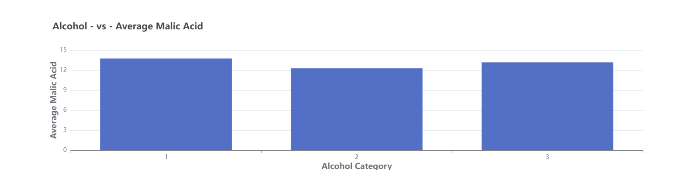
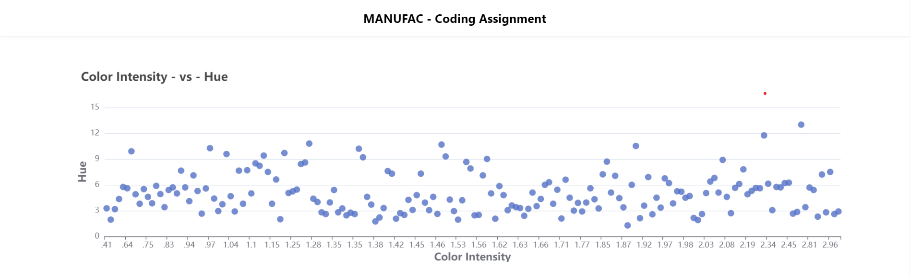
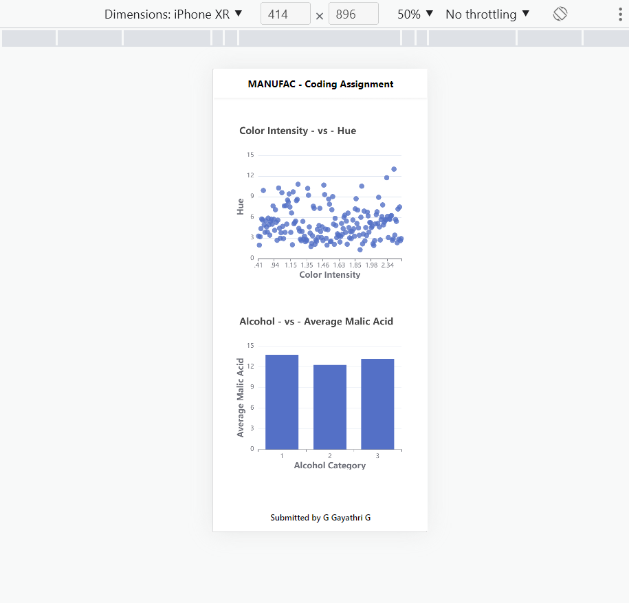

# Clone url

https://github.com/Gayathri3G/Manufac_Assignment.git

# To run the project, execute the following commands in Command Promptt, in the cloned folder directory

'cd Manufac_Assignment'
'yarn install'
'yarn start'

# The project would be available in http://localhost:3003

# App Images

;
;
;
;
;
